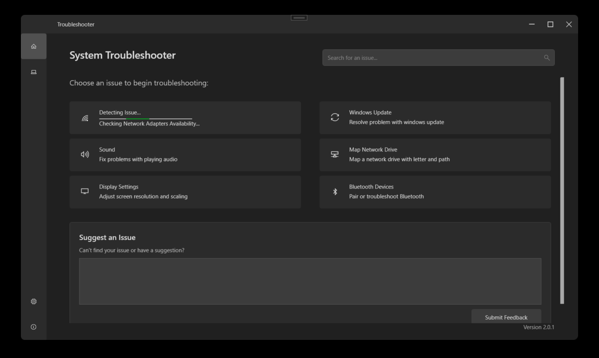

# System TroubleShooter  [](https://github.com/BoudinDjama/SystemTroubleShooter/actions/workflows/main.yml)

As someone who enjoys fixing IT issues and always looks for opportunities to automate with PowerShell, the concept of building an app for common/company-specific problems was very appealing. Throughout this project, I have applied my years of IT experience. It has also significantly deepened my passion and love for programming.

The System TroubleShooter is a desktop application aimed at automating the resolution of frequent IT problems. It utilizes the MVVM architecture within the WPF framework, creating a clean separation of concerns and facilitating maintainability. The project is currently under active development, with ongoing efforts to revise the user interface and restructure the application for improved functionality.

---

## ✨ Key Features 🔧

* **Internet Troubleshooting**: Automatically diagnose and suggest fixes for common internet connection problems.
* **Sound Issue Diagnostics**: Walk through steps to identify and resolve audio playback or recording issues.
* **Network Drive Management**: Easily accessing your mapped network drives.
* **Update Status Checker**: Quickly verify the status of System Updates and guide you through potential issues.
* **Bluetooth pairing and fixing**: Verify and fix bluetooth issues

---

## 🖼️ Screenshots


*Get started here! This view offers clear navigation to the various troubleshooting options.*


---

## 🛠️ Technologies Used

* **C#**: The primary programming language.
* **WPF (Windows Presentation Foundation)**: The framework for building the desktop user interface.
* **MVVM (Model-View-ViewModel)**: The architectural pattern for structuring the application.
* **PowerShell**: The code behind for enhanced repair-functions and diagnostics.

---

## 🚀 Getting Started

1.  **Clone the repository**:
    ```bash
    git clone [https://github.com/yourusername/WindowsTroubleshooter.git](https://github.com/yourusername/WindowsTroubleshooter.git)
    ```
2.  **Open in Visual Studio**: Navigate to the cloned directory and open the `.sln` file in Visual Studio.
3.  **Build the Solution**: Use the default build configuration in Visual Studio.
4.  **Run the Application**: Press `Ctrl+F5` or click the "Start" button to launch the System Troubleshooter.

Feel free to give any feedback
